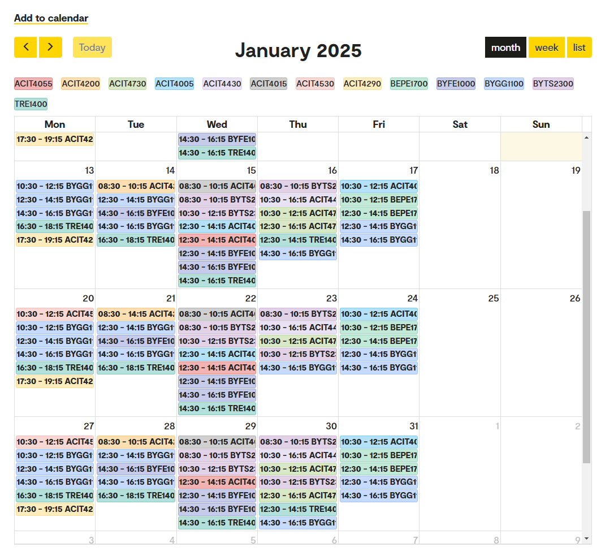

# Master's Programme in Applied Computer and Information Technology

### **Vår 2025**

* ACIT4005 - Technology and society - Critical perspectives in practice []
* ACIT4015 - Internet of Things []
* ACIT4055 - Security politics, cyberwar, and ethics []
* ACIT4200 - Interdiciplinary innovation and complex problems []
* ACIT4290 - Practical cybersecurity []
* ACIT4430 - Infrastructure Services and Operations []
* ACIT4530 Data Mining at Scale: Algorithms and Systems []
* ACIT4730 - Special biomedical engineering subject []